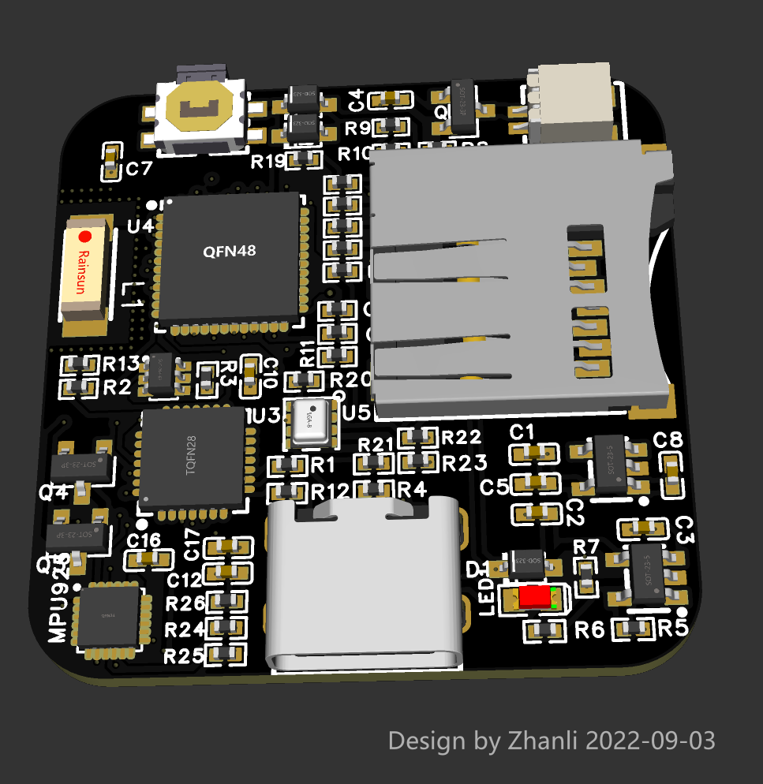
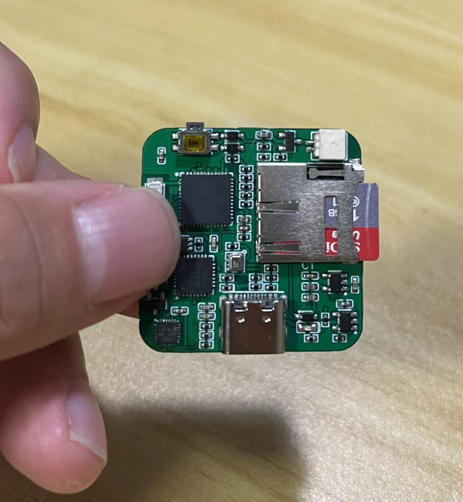
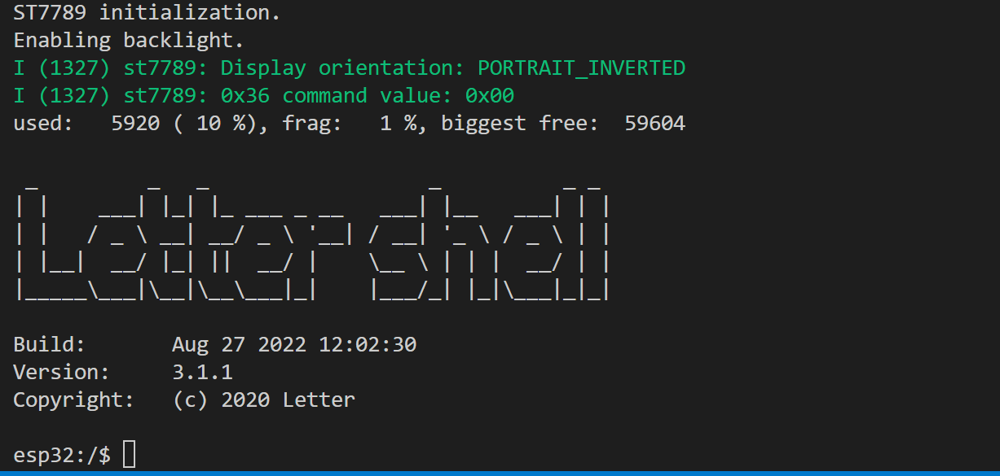

# **GeekTrack**

## 一、功能描述：

一个无线姿态追踪模块，可以追踪姿态。可以用于全身动作捕捉也可以用于人体步态追踪, GeekTrack实际是GeekMotion阉割屏幕减少尺寸的版本，目的是为了方便固定在身体上，用于姿态追踪

- WIFI通信功能
- IMU、MAG传感器、气压传感器、温度传感器
- LettleShell命令行模块，可以采用命令行和ESP32交互。
- 计步器
- 运动识别(待实现)
- 电梯识别(待实现)
- SD卡存储





命令行支持(移植letter shell)：



支持：

- 命令行自动补全
- 历史命令行记忆
- ...

注意：命令行被log覆盖的时候按下回车即可。

## 二、使用方法

WIFI的配置(通过命令行)：

```shell
# 命令行设置WIFI账号和密码
set_wifi_cfg "your wifi ssid" "your wifi password"
# 设置完成后重启生效
reboot
```

配置设备索引：可以用数字表示设备的索引，数字可以为0~65536

```shell
set_dev_idx  "device_type_num" 
```

设备传感器信息的发送，默认UDP端口9000：

```shell
# dev_Index yaw roll pitch
0 -75.127640 5.829678 -67.846695
0 -75.029457 5.810158 -67.830681
0 -74.926865 5.784514 -67.806129
```

## 三、更新日志

**2022-09-03 :**  上传第一版原理图和PCB图

**2022-09-19 :**  第一版固件调试通过

**2022-09-24 :**  

1. 优化app_main, 精简总行数 < 40
2. 调整结构，迁移网络部分到HAL_Network.cpp
3. 删除GeekTrack无用的关于lvgl部分
4. 删除无用的lvgl仿真器
5. 增加NVS存储获取设备索引信息(Idx,可以描述设备0~n)
6. UDP发送增加Idx识别信息
7. 增加NVS设置Idx

**2022-09-25:**  增加NVS设置WIFI ssid和WIFI 密码功能

## 四、编译说明

**lettleShell移植支持说明：** 需要适配esp32的ld文件。

样例：
C:\Users\Administrator\esp\esp-idf\components\esp32\ld\
在这个文件夹里面，把原来的esp32.project.ld.in替换当前目前的id文件，用于支持命令行，替换前记得备份

```c++
  /* 核心原理是找到这个.flash.appdesc, 然后加入_shell_command_start和*_shell_command_end/  
.flash.appdesc : ALIGN(0x10)
  {
    _rodata_start = ABSOLUTE(.);

    *(.rodata_desc .rodata_desc.*)               /* Should be the first.  App version info.        DO NOT PUT ANYTHING BEFORE IT! */
    *(.rodata_custom_desc .rodata_custom_desc.*) /* Should be the second. Custom app version info. DO NOT PUT ANYTHING BEFORE IT! */
	
	_shell_command_start = ABSOLUTE(.);
	KEEP (*(shellCommand))
	_shell_command_end = ABSOLUTE(.);

    /* Create an empty gap within this section. Thanks to this, the end of this
     * section will match .flah.rodata's begin address. Thus, both sections
     * will be merged when creating the final bin image. */
    . = ALIGN(ALIGNOF(.flash.rodata));
  } >default_rodata_seg
```

